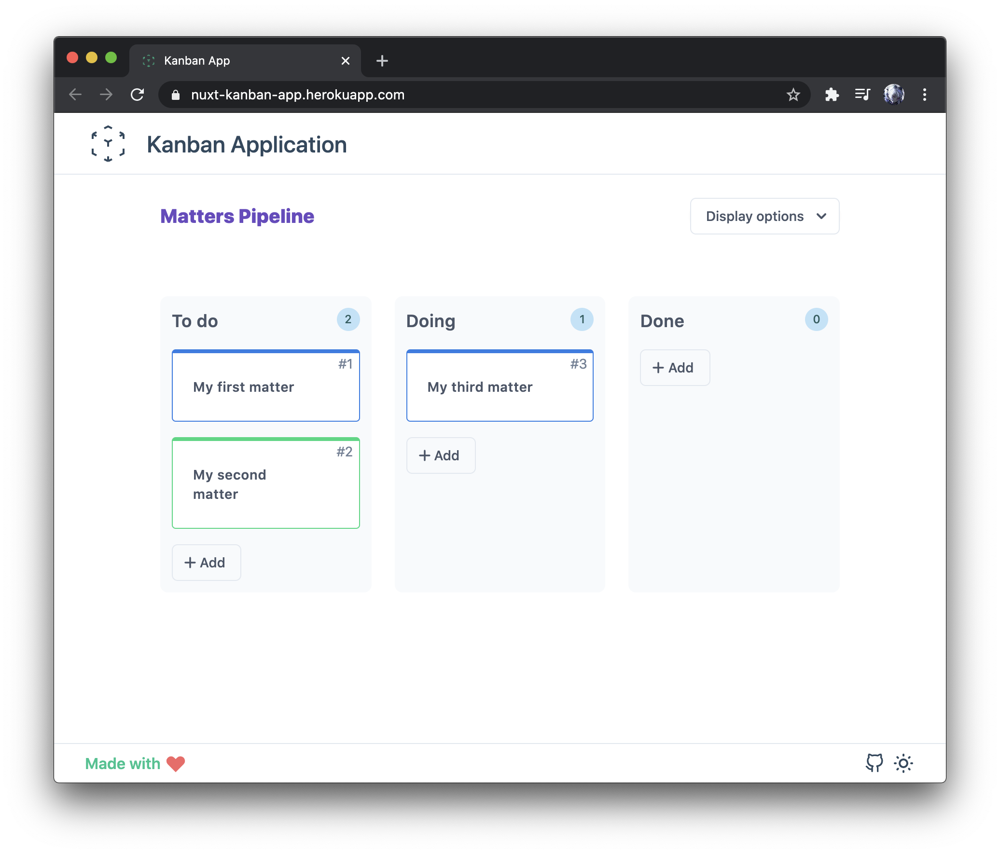
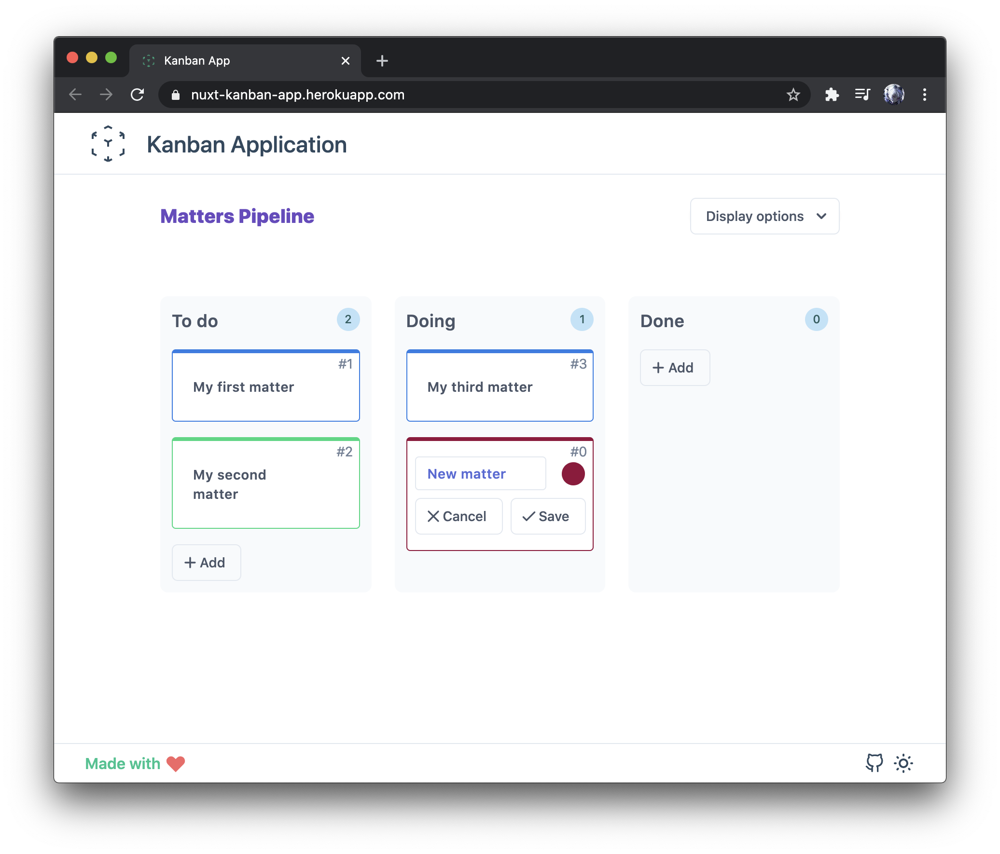
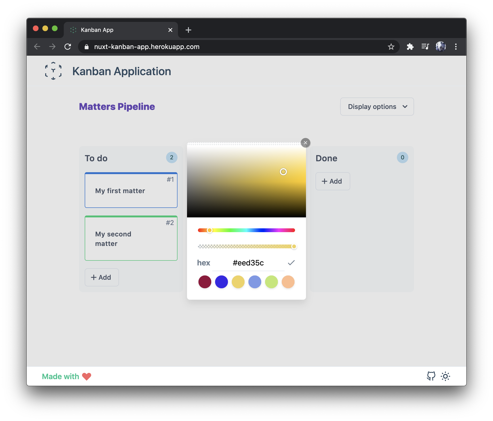

[](https://nuxt-kanban-app.herokuapp.com)


# Nuxt Kanban App

> A simple kanban board where items can be dragged and dropped from the list.

<p float="left">
  
  
</p>
<p align="center">
  <a href="https://nuxt-kanban-app.herokuapp.com">Live demo</a>
</p>


## Table of Contents
- [Nuxt Kanban App](#nuxt-kanban-app)
  - [Table of Contents](#table-of-contents)
  - [Getting started](#getting-started)
  - [Conventional Commits](#conventional-commits)
  - [Linting](#linting)
  - [Testing](#testing)
    - [Unit testing](#unit-testing)
  - [Build Setup](#build-setup)
  - [Containerized application](#containerized-application)
    - [Using Dockerfile only](#using-dockerfile-only)
    - [Using Docker compose](#using-docker-compose)
  - [License](#license)

## Getting started

```bash
# install dependencies
$ yarn install

# serve with hot reload at localhost:3000
$ yarn dev
```

## Conventional Commits
[Conventional Commits](https://www.conventionalcommits.org) is a specification for adding human and machine readable meaning to commit messages shared by a large community of developers.

## Linting

Many JavaScript implementations do not warn against questionable coding practices. Yes, that's nice for the site that 
"works best with Internet Explorer" (designed with templates, scripted with snippets copied from forums). But it's a 
nightmare when you actually want to write quality, maintainable code.

That's where JavaScript Lint comes in. With JavaScript Lint, you can check all your JavaScript source code for common 
mistakes without actually running the script or opening the web page.

## Testing

### Unit testing

Please see [test guide](test/README.md).

## Build Setup

```bash
# build for production and launch server
$ yarn build
$ yarn start
```

For detailed explanation on how things work, check out [Nuxt.js docs](https://nuxtjs.org).

## Containerized application
You are not a web developper but you want to try the app and maybe deploy it everywhere around the world ? 
Let's some fun 😉

### Using Dockerfile only
```bash
# Build our kanban app image
docker build -t kanban .

# Run it in detach mode
docker run --name kanban -p 3000:3000 kanban
```

### Using Docker compose
```bash
# Build in detach mode our kanban app image
docker-compose up -d --build

# To enter inside the kanban container
docker-compose exec kanban sh
```

## License

[MIT License](./LICENSE)